# Proyecto Guiado SOR - China Hotel - 2ºSMR

# Preparación

**Objetivo:**  
Configurar un entorno de laboratorio con **Hyper‑V**, un **controlador de dominio (DC)** y un **servidor miembro**, utilizando Windows Server 2022 Evaluation Edition. Incluye instalación, configuración de red y promoción del dominio.

---

## 🧩 Índice

1. [Instalar Hyper‑V](#instalar-hyper-v)
2. [Crear máquina virtual del controlador de dominio (TAILWIND-DC1)](#crear-controlador-de-dominio)
3. [Promocionar TAILWIND-DC1 a controlador de dominio](#promocionar-dc)
4. [Crear servidor miembro (TAILWIND-MBR1)](#crear-servidor-miembro)
5. [Unir TAILWIND-MBR1 al dominio](#unir-mbr-al-dominio)
6. [Diagramas de flujo](#diagramas-de-flujo)

---

## 🖥️ Instalar Hyper‑V


1. Iniciar sesión en Windows 10.
2. Abrimos **Configuración → Sistema → Características opcionales**.
3. Seleccionar **Más funciones de Windows → Hyper‑V**.
4. Aceptar y **reiniciar**.
5. Abrir **Hyper‑V Manager** y fijarlo en la barra de tareas.
6. Configurar rutas por defecto:

   * Máquinas virtuales: `C:\VirtualMachines`
   * VHDs: `C:\VirtualMachines\VHDs`
7. Crear red NAT desde PowerShell (admin):


```
New-VMSwitch -SwitchName "NATSwitch" -SwitchType Internal
New-NetIPAddress -IPAddress 10.10.10.1 -PrefixLength 24 -InterfaceAlias "vEthernet (NATSwitch)"
New-NetNat -Name "NATNetwork" –InternalIPInterfaceAddressPrefix "10.10.10.0/24"
```

---

## 🏛️ Crear controlador de dominio

### 1. Crear máquina virtual

1. Hyper‑V → **Nuevo → Máquina virtual**.
2. Nombre: **TAILWIND-DC1**.
3. Generación 2.
4. RAM: **4096 MB**, con memoria dinámica.
5. Red: **NAT**.
6. Disco: usar valores por defecto.
7. Instalar SO desde ISO `SERVER_EVAL_x64FRE_en-us.iso`.
8. Finalizar.

## 2. Configuración inicial

1. Desactivar checkpoints automáticos.
2. Iniciar VM y arrancar desde ISO.
3. Instalar **Windows Server 2022 (Experiencia de escritorio)**.
4. Contraseña del administrador: `Pa55w.rdPa55w.rd`.
5. Configurar IP:

```
IP: 10.10.10.10
Máscara: 255.255.255.0
Puerta de enlace: 10.10.10.1
DNS Primario: 1.1.1.1
DNS Secundario: 8.8.8.8
```


6. Cambiar nombre del equipo → **TAILWIND-DC1** y reiniciar.


---

## 🌐 Promocionar TAILWIND-DC1 a Controlador de Dominio

1. Abrir **Administrador del servidor**.
2. **Agregar roles y características**.
3. Seleccionar rol: **Servicios de dominio de Active Directory**.
4. Instalar.
5. Notificación → **Promocionar este servidor a controlador de dominio**.
6. Crear **nuevo bosque** → Dominio raíz: `tailwindtrader.internal`.
7. Contraseña DSRM: `Pa55w.rdPa55w.rd`.
8. Finalizar e instalar (reinicio automático).

---

# 🖥️ Crear servidor miembro

## 1. Crear VM ChinaHotelMiembro1

1. Hyper‑V → Nueva máquina virtual.
2. Nombre: **TAILWIND-MBR1**.
3. Generación 2.
4. RAM 4096 MB.
5. NATSwitch.
6. Instalar desde ISO.
7. Desactivar checkpoints.

## 2. Configuración inicial

1. Instalar Windows Server.
2. Contraseña admin: `Pa55w.rdPa55w.rd`.
3. Configurar IP:

```
IP: 10.10.10.20
Máscara: 255.255.255.0
Puerta de enlace: 10.10.10.1
DNS Primario: 10.10.10.10
DNS Secundario: 8.8.8.8
```


4. Reiniciar.

---

# 🔗 Unir TAILWIND-MBR1 al dominio

1. Abrir **Propiedades del sistema**.
2. Miembro de → **Dominio: TAILWINDTRADERS**.
3. Credenciales:

```
Usuario: TAILWINDTRADERS\Administrator
Contraseña: Pa55w.rdPa55w.rd
```


4. Mensaje de bienvenida.


5. Reiniciar.

---

# 📊 Diagramas de flujo

## 🔧 Flujo: Instalación de Hyper‑V

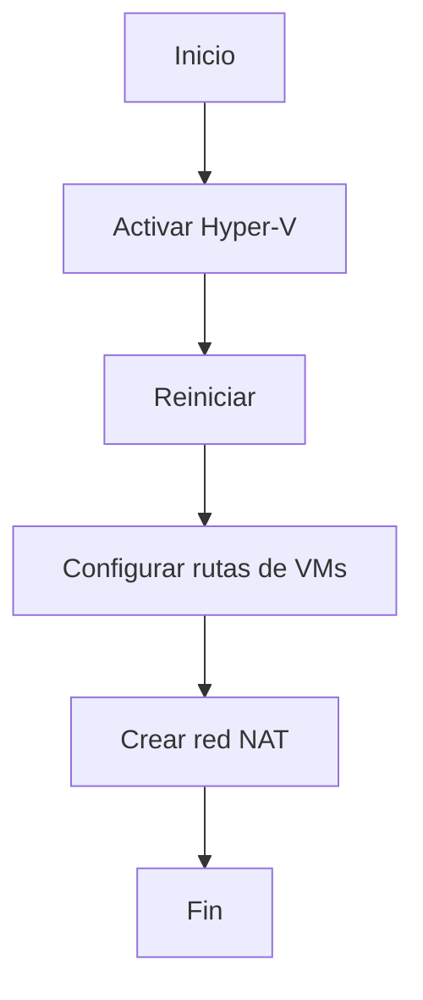

## 🏛️ Flujo: Promoción a Controlador de Dominio

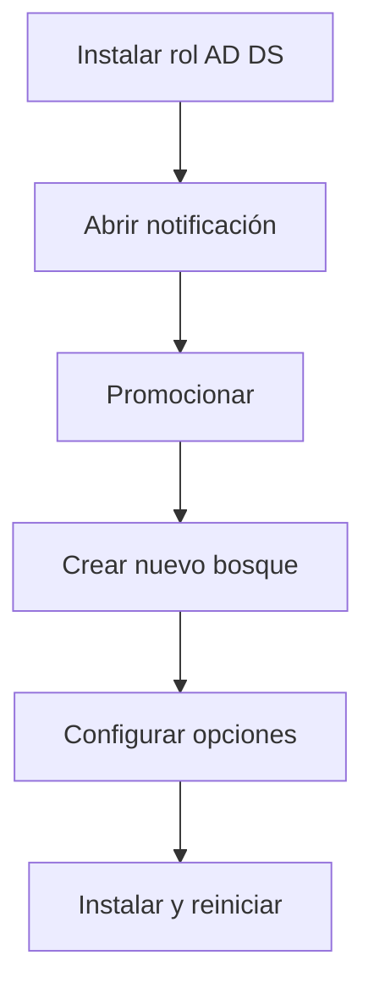

## 🔗 Flujo: Unión de servidor al dominio

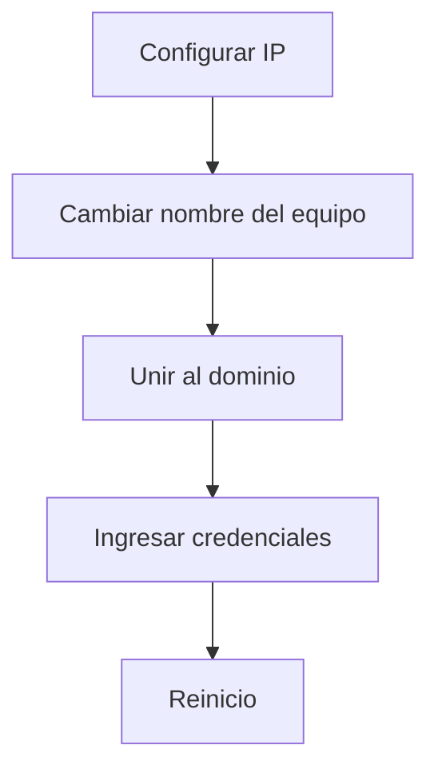

---

# ✅ Preparación completada

# Configuración de operaciones de controlador de dominio

# Proyecto: Administración avanzada de Active Directory (AZ-1008)

**Objetivo:** 

Ampliar la infraestructura de **Active Directory** promoviendo un segundo controlador de dominio, transfiriendo roles FSMO y configurando **sitios y subredes** para una correcta replicación y administración del directorio.

---

# 🧩 Índice

1. [Promover servidor miembro a controlador de dominio](#promover-servidor-miembro-a-controlador-de-dominio)
2. [Transferir roles FSMO (RID Master)](#transferir-roles-fsmo)
3. [Crear sitio de Active Directory y subred](#crear-sitio-de-active-directory-y-subred)
4. [Diagramas de flujo](#diagramas-de-flujo)

---

# 🏛️ Promover servidor miembro a controlador de dominio

En esta sección se promueve **TAILWIND-MBR1** a controlador de dominio adicional dentro del dominio existente `tailwindtraders.internal`.

## Pasos

1. Iniciar sesión en **TAILWIND-MBR1** como:

```
TAILWINDTRADERS\Administrator
Contraseña: Pa55w.rdPa55w.rd
```

2. Abrir **Administrador del servidor → Administrar → Agregar roles y características**.
3. Seleccionar **Instalación basada en roles o características**.
4. Elegir el servidor **TAILWIND-MBR1**.
5. Marcar el rol **Servicios de dominio de Active Directory (AD DS)**.
6. Agregar las características requeridas y continuar.
7. Confirmar e iniciar la instalación.
8. Al finalizar, hacer clic en el **icono de notificación**.
9. Seleccionar **Promocionar este servidor a controlador de dominio**.
10. Elegir **Agregar un controlador de dominio a un dominio existente**.
11. Verificar el dominio: `tailwindtraders.internal`.


12. Reautenticarse como Administrator.


13. Introducir la contraseña **DSRM**:

```
Pa55w.rdPa55w.rd
```


14. Aceptar opciones por defecto (DNS, rutas, revisión).
15. Instalar y permitir el **reinicio automático**.

---

# 🔁 Transferir roles FSMO

Se transfiere el rol **RID Master** desde **TAILWIND-DC1** hacia **TAILWIND-MBR1**.

## Pasos

1. En **TAILWIND-MBR1**, abrir:
   **Herramientas → Usuarios y equipos de Active Directory**.
2. Clic derecho sobre el dominio → **Todas las tareas → Maestros de operaciones**.
3. En la pestaña **RID**, seleccionar **Cambiar**.
4. Confirmar con **Sí**.
5. Cerrar la ventana de Maestros de operaciones.


---

# 🌍 Crear sitio de Active Directory y subred

Esta configuración optimiza la replicación y representa una ubicación física de red.

## Pasos

1. Iniciar sesión en **TAILWIND-DC1** como:

```
tailwindtraders\Administrator
```

2. Abrir **Herramientas → Sitios y servicios de Active Directory**.
3. Clic derecho en **Sitios → Nuevo sitio**.
4. Nombre del sitio: **Sydney**.


6. Seleccionar **DEFAULTIPSITELINK** y confirmar.
7. Expandir la carpeta **Sitios**.
8. Clic derecho en **Subredes → Nueva subred**.
9. Prefijo de subred:

```
172.16.1.0/24
```

9. Asociar la subred al sitio **Sydney**.
10. Aceptar y cerrar la consola.


---

# 📊 Diagramas de flujo

## 🏛️ Flujo: Promoción a controlador de dominio adicional

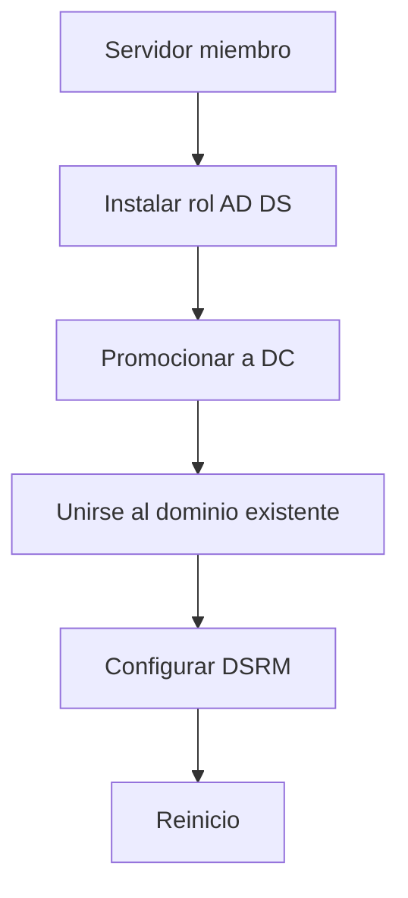

## 🔁 Flujo: Transferencia de rol FSMO

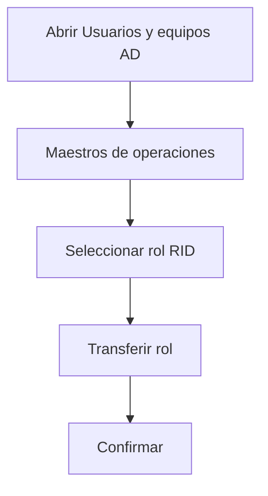

## 🌍 Flujo: Creación de sitio y subred

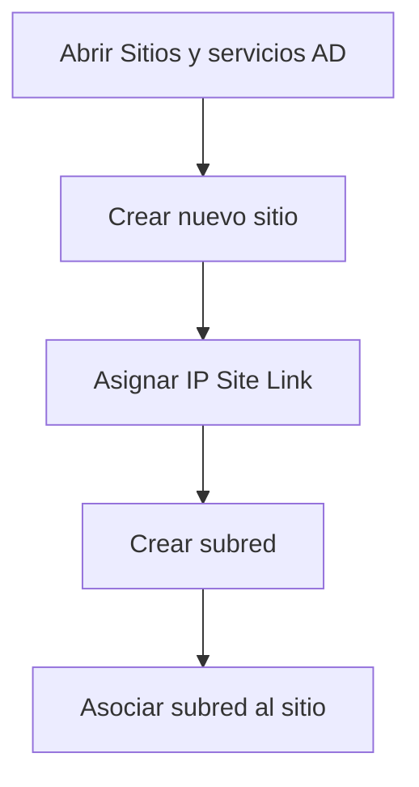

---

# ✅ Resultado

La infraestructura de Active Directory ahora cuenta con:

* Dos controladores de dominio
* Rol FSMO transferido
* Sitio y subred configurados


#  Configuración de operaciones de administración de usuarios

**Objetivo:**

Gestionar **usuarios, grupos y unidades organizativas (OU)** en Active Directory, aplicando buenas prácticas de administración como delegación de permisos, usuarios protegidos, atributos de búsqueda y control de cuentas.

---

# 🧩 Índice

1. [Crear Unidades Organizativas (OU)](#crear-unidades-organizativas-ou)
2. [Crear usuarios](#crear-usuarios)
3. [Crear grupo Sydney Administrators](#crear-grupo-sydney-administrators)
4. [Configurar usuario como Protected User](#configurar-usuario-como-protected-user)
5. [Delegar permisos a un grupo sobre una OU](#delegar-permisos-a-un-grupo-sobre-una-ou)
6. [Configurar atributo City y búsqueda](#configurar-atributo-city-y-búsqueda)
7. [Deshabilitar usuario Melbourne](#deshabilitar-usuario-melbourne)
8. [Restablecer contraseña del usuario Brisbane](#restablecer-contraseña-del-usuario-brisbane)
9. [Diagramas de flujo](#diagramas-de-flujo)

---

# 🗂️ Crear Unidades Organizativas (OU)

Se crean tres OU para organizar los objetos del dominio por ubicación.

## Pasos

1. En **TAILWIND-DC1**, abrir **Usuarios y equipos de Active Directory** desde **Herramientas**.
2. Clic derecho sobre el dominio `tailwindtraders.internal`.
3. Seleccionar **Nuevo → Unidad organizativa**.
4. Crear las siguientes OU:

   * **Sydney**
   * **Melbourne**
   * **Brisbane**


---

# 👤 Crear usuarios

Se crean usuarios contratistas y se configura la expiración de la cuenta.

## Pasos

1. En **TAILWIND-DC1**, abrir **Usuarios y equipos de Active Directory**.
2. Clic derecho sobre la OU **Sydney → Nuevo → Usuario**.
3. Completar los campos:

```
Nombre completo: SydneyContractor
Nombre de inicio de sesión: SydneyContractor
```


4. Establecer contraseña:

```
Pa55w.rdPa55w.rd
```


5. Finalizar el asistente.
6. Abrir las propiedades del usuario **SydneyContractor**.
7. En la pestaña **Cuenta**, configurar **Expiración de la cuenta**:

```
Fecha: 1 de enero de 2030
```


8. Clic derecho sobre **SydneyContractor → Copiar**.
9. Crear los siguientes usuarios:

   * **MelbourneContractor**
   * **BrisbaneContractor**

10. Mover:

* **MelbourneContractor** a la OU **Melbourne**
* **BrisbaneContractor** a la OU **Brisbane**

11. Confirmar los avisos de movimiento.


---

# 👥 Crear grupo Sydney Administrators

Se crea un grupo de seguridad para administración delegada.

## Pasos

1. En **Usuarios y equipos de Active Directory**, clic derecho sobre la OU **Sydney**.
2. Seleccionar **Nuevo → Grupo**.
3. Configurar:

```
Nombre del grupo: Sydney Administrators
Ámbito: Universal
```

4. Abrir el usuario **SydneyContractor**.
5. Pestaña **Miembro de → Agregar**.
6. Añadir:

```
Sydney Administrators
```


7. Confirmar cambios.

---

# 🛡️ Configurar usuario como Protected User

Esta opción aumenta la seguridad del usuario frente a ataques de credenciales.

## Pasos

1. Abrir **SydneyContractor**.
2. Pestaña **Miembro de → Agregar**.
3. Añadir el grupo:

```
Protected Users
```


4. Confirmar.

---

# 🔐 Delegar permisos a un grupo sobre una OU

Se delega la capacidad de restablecer contraseñas en la OU Sydney.

## Pasos

1. Clic derecho sobre la OU **Sydney → Delegar control**.
2. Siguiente en el asistente.
3. Agregar el grupo:

```
Sydney Administrators
```


4. Seleccionar la tarea:

```
Restablecer contraseñas de usuario y forzar el cambio en el próximo inicio de sesión
```


5. Finalizar.

---

# 🏙️ Configurar atributo City y búsqueda

Se asigna el atributo **City** a un usuario y se valida mediante búsqueda avanzada.

## Pasos

1. Abrir las propiedades de **SydneyContractor**.
2. Pestaña **Dirección**.
3. Configurar:

```
Ciudad: Sydney
```


4. Clic derecho sobre el dominio → **Buscar**.
5. Pestaña **Avanzado**:

```
Campo: Usuario → City
Condición: Es exactamente
Valor: Sydney
```


6. Ejecutar búsqueda y verificar resultados.


---

# 🚫 Deshabilitar usuario Melbourne

## Pasos

1. Abrir la OU **Melbourne**.
2. Clic derecho sobre **MelbourneContractor**.
3. Seleccionar **Deshabilitar cuenta**.
4. Confirmar.


---

# 🔑 Restablecer contraseña del usuario Brisbane

## Pasos

1. Abrir la OU **Brisbane**.
2. Clic derecho sobre **BrisbaneContractor → Restablecer contraseña**.
3. Establecer la nueva contraseña:

```
Pa66w.rdPa66w.rd
```


4. Confirmar los mensajes.

---

# 📊 Diagramas de flujo

## 🗂️ Flujo: Gestión de usuarios y OU

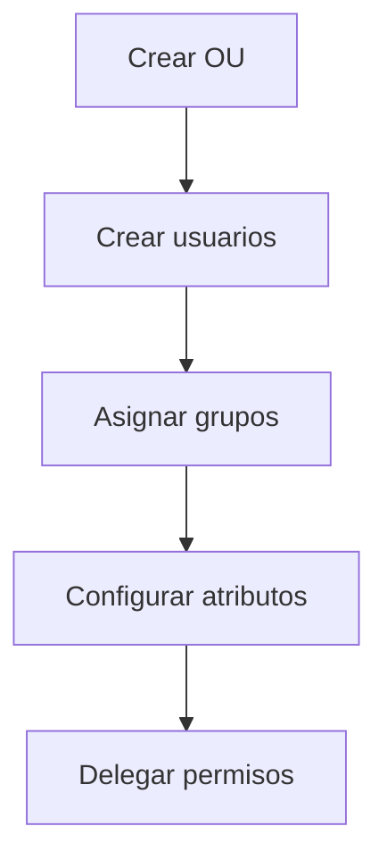

## 🔐 Flujo: Administración de cuentas

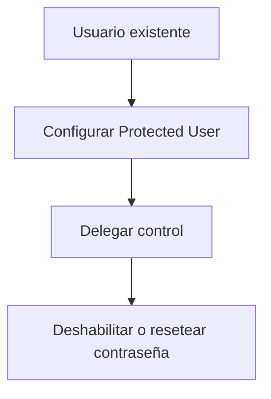

---

# ✅ Resultado

El dominio ahora cuenta con:

* OU organizadas por ciudad
* Usuarios y grupos configurados
* Seguridad reforzada
* Permisos delegados correctamente

# Administrar directivas de contraseña

**Objetivo:**

Configurar **políticas de contraseñas en Active Directory** para reforzar la seguridad del dominio, incluyendo:

* Política de contraseñas a nivel de dominio
* Política de contraseñas de grano fino para administradores
* Habilitación de la **Papelera de reciclaje de Active Directory**

---

# 🧩 Índice

1. [Configurar la política de contraseñas del dominio](#configurar-la-política-de-contraseñas-del-dominio)
2. [Configurar una política de contraseñas de grano fino](#configurar-una-política-de-contraseñas-de-grano-fino)
3. [Habilitar la Papelera de reciclaje de Active Directory](#habilitar-la-papelera-de-reciclaje-de-active-directory)
4. [Diagramas de flujo](#diagramas-de-flujo)

---

# 🔐 Configurar la política de contraseñas del dominio

Esta política afecta a **todos los usuarios del dominio**, salvo aquellos que tengan políticas de grano fino aplicadas.

## Pasos

1. En **TAILWIND-DC1**, abrir **Administración de directivas de grupo** desde **Herramientas**.
2. Expandir:

```
Bosque: tailwindtraders.internal
 → Dominios
   → tailwindtraders.internal
```

3. Clic derecho sobre **Directiva de dominio predeterminada** → **Editar**.
4. Navegar a:
(En esta parte el manual de Microsoft esta mal, en vez de salirte Politicas en la maquina lo que salen son directivas, lo he corregido para que este bien)

```
Configuración del equipo
 → Directivas
   → Configuración de Windows
     → Configuración de seguridad
       → Directivas de cuenta
         → Directiva de contraseñas
```

5. Abrir **Longitud mínima de la contraseña**.
6. Establecer el valor en:

```
14 caracteres
```


7. Aplicar cambios y cerrar el editor.
8. Cerrar la consola de Administración de directivas de grupo.

---

# 🧬 Configurar una política de contraseñas de grano fino

Las políticas de grano fino permiten aplicar **requisitos distintos** a usuarios o grupos específicos.

## Pasos

1. En **TAILWIND-DC1**, abrir el **Centro administrativo de Active Directory**.
2. En **Descripción general**, seleccionar **Tailwindtraders (local)**.
3. Abrir el contenedor:

```
Sistema
 → Contenedor de configuración de contraseña
```

4. Clic derecho → **Nuevo → Configuración de contraseña**.
5. Configurar los siguientes valores:

```
Nombre: Domain Admin Password Policy
Precedencia: 1
Longitud mínima de contraseña: 16
```


6. Guardar la política.
7. Abrir la política creada.
8. En **Se aplica directamente a**, hacer clic en **Agregar**.
9. Añadir el grupo:

```
Domain Admins
```

10. Comprobar nombres y confirmar.
(El manual esta mal, me pone nombre no encontrado ya que no hemos creado ningun grupo llamado "Domain Admins" en ningu sitio)


---

# ♻️ Habilitar la Papelera de reciclaje de Active Directory

## Pasos

1. En **TAILWIND-DC1**, abrir el **Centro administrativo de Active Directory**.
2. Seleccionar **Tailwindtraders (local)**.
3. En el panel derecho, hacer clic en:

```
Habilitar papelera de reciclaje
```

4. Confirmar la advertencia inicial.
5. Confirmar la advertencia sobre latencia de replicación.

(No me salia nada de bin / papelera)


---

# 📊 Diagramas de flujo

## 🔐 Flujo: Política de contraseñas del dominio

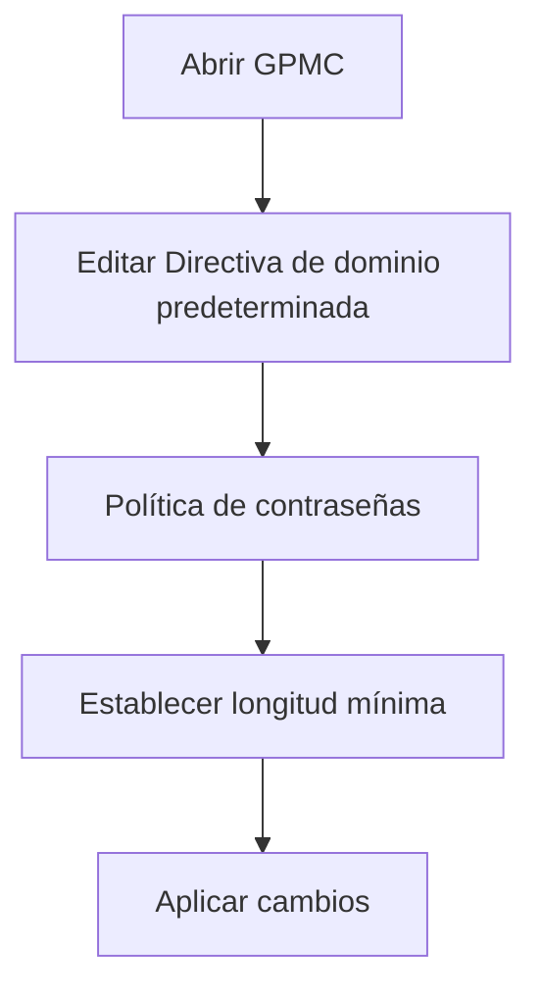

## 🧬 Flujo: Política de grano fino

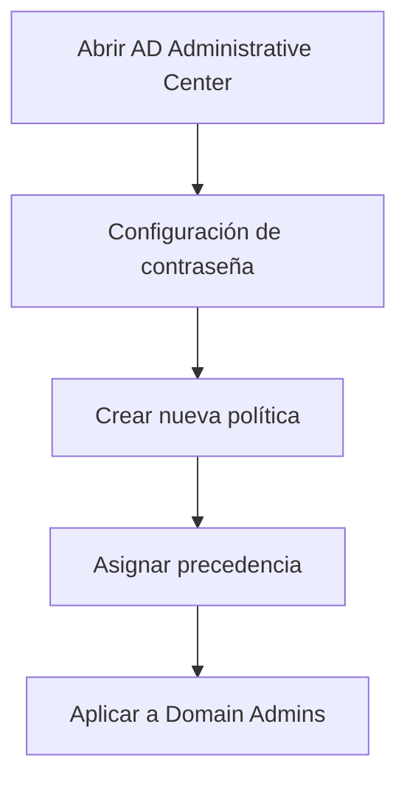

## ♻️ Flujo: Papelera de reciclaje de AD

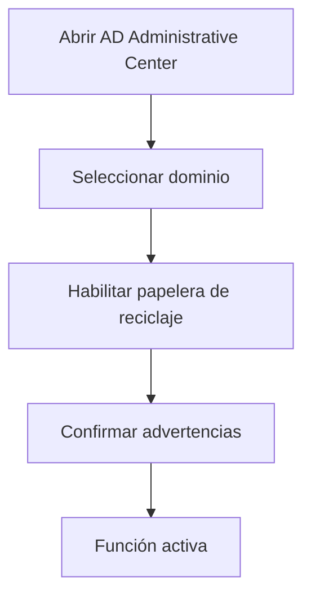

---

# ✅ Resultado

El dominio ahora cuenta con:

* Política de contraseñas reforzada a nivel global
* Política más estricta para administradores
* Capacidad de recuperación de objetos eliminados

Documento listo para subirse a **GitHub** como archivo `.md`.
