# Proyecto Guiado SOR - China Hotel - 2ºSMR

# Preparación

**Objetivo:**  
Configurar un entorno de laboratorio con **Hyper‑V**, un **controlador de dominio (DC)** y un **servidor miembro**, utilizando Windows Server 2022 Evaluation Edition. Incluye instalación, configuración de red y promoción del dominio.

---

## 🧩 Índice

1. [Instalar Hyper‑V](#instalar-hyper-v)
2. [Crear máquina virtual del controlador de dominio (TAILWIND-DC1)](#crear-controlador-de-dominio)
3. [Promocionar TAILWIND-DC1 a controlador de dominio](#promocionar-dc)
4. [Crear servidor miembro (TAILWIND-MBR1)](#crear-servidor-miembro)
5. [Unir TAILWIND-MBR1 al dominio](#unir-mbr-al-dominio)
6. [Diagramas de flujo](#diagramas-de-flujo)

---

## 🖥️ Instalar Hyper‑V


1. Iniciar sesión en Windows 10.
2. Abrimos **Configuración → Sistema → Características opcionales**.
3. Seleccionar **Más funciones de Windows → Hyper‑V**.
4. Aceptar y **reiniciar**.
5. Abrir **Hyper‑V Manager** y fijarlo en la barra de tareas.
6. Configurar rutas por defecto:

   * Máquinas virtuales: `C:\VirtualMachines`
   * VHDs: `C:\VirtualMachines\VHDs`
7. Crear red NAT desde PowerShell (admin):


```
New-VMSwitch -SwitchName "NATSwitch" -SwitchType Internal
New-NetIPAddress -IPAddress 10.10.10.1 -PrefixLength 24 -InterfaceAlias "vEthernet (NATSwitch)"
New-NetNat -Name "NATNetwork" –InternalIPInterfaceAddressPrefix "10.10.10.0/24"
```

---

## 🏛️ Crear controlador de dominio

### 1. Crear máquina virtual

1. Hyper‑V → **Nuevo → Máquina virtual**.
2. Nombre: **ChinaHotel**.
3. Generación 2.
4. RAM: **4096 MB**, con memoria dinámica.
5. Red: **NAT**.
6. Disco: usar valores por defecto.
7. Instalar SO desde ISO `SERVER_EVAL_x64FRE_en-us.iso`.
8. Finalizar.

## 2. Configuración inicial

1. Desactivar checkpoints automáticos.
2. Iniciar VM y arrancar desde ISO.
3. Instalar **Windows Server 2022 (Experiencia de escritorio)**.
4. Contraseña del administrador: `Pa55w.rdPa55w.rd`.
5. Configurar IP:

```
IP: 10.10.10.10
Máscara: 255.255.255.0
Puerta de enlace: 10.10.10.1
DNS Primario: 1.1.1.1
DNS Secundario: 8.8.8.8
```

6. Cambiar nombre del equipo → **CHINAHOTEL-DC1** y reiniciar.

---

## 🌐 Promocionar China Hotel a Controlador de Dominio

1. Abrir **Administrador del servidor**.
2. **Agregar roles y características**.
3. Seleccionar rol: **Servicios de dominio de Active Directory**.
4. Instalar.
5. Notificación → **Promocionar este servidor a controlador de dominio**.
6. Crear **nuevo bosque** → Dominio raíz: `chinahotel.internal`.
7. Contraseña DSRM: `Pa55w.rdPa55w.rd`.
8. Finalizar e instalar (reinicio automático).

---

# 🖥️ Crear servidor miembro

## 1. Crear VM ChinaHotelMiembro1

1. Hyper‑V → Nueva máquina virtual.
2. Nombre: **ChinaHotelMiembro1**.
3. Generación 2.
4. RAM 4096 MB.
5. NATSwitch.
6. Instalar desde ISO.
7. Desactivar checkpoints.

## 2. Configuración inicial

1. Instalar Windows Server.
2. Contraseña admin: `Pa55w.rdPa55w.rd`.
3. Configurar IP:

```
IP: 10.10.10.20
Máscara: 255.255.255.0
Puerta de enlace: 10.10.10.1
DNS Primario: 10.10.10.10
DNS Secundario: 8.8.8.8
```

4. Reiniciar.

---

# 🔗 Unir CHINAHOTEL-MBR1 al dominio

1. Abrir **Propiedades del sistema**.
2. Miembro de → **Dominio: CHINAHOTEL**.
3. Credenciales:

```
Usuario: CHINAHOTEL\Administrator
Contraseña: Pa55w.rdPa55w.rd
```

4. Mensaje de bienvenida.
5. Reiniciar.

---

# 📊 Diagramas de flujo

## 🔧 Flujo: Instalación de Hyper‑V


## 🏛️ Flujo: Promoción a Controlador de Dominio

```mermaid
flowchart TD
    A[Instalar rol AD DS] --> B[Abrir notificación]
    B --> C[Promocionar]
    C --> D[Crear nuevo bosque]
    D --> E[Configurar opciones]
    E --> F[Instalar y reiniciar]
```



## 🔗 Flujo: Unión de servidor al dominio


---

# ✅ Preparación completada

# Configuración de operaciones de controlador de dominio
