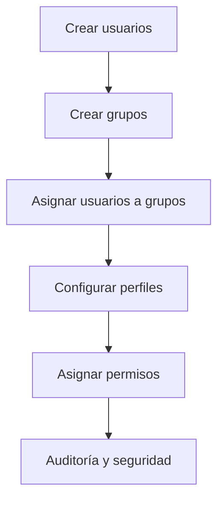

# Proyecto: Gestión de Usuarios y Grupos en el Dominio

## Hotel Gran Descanso Plus – RA2

---

## 🎯 Objetivo General

Implementar una **gestión completa de identidades** en el dominio del *Hotel Gran Descanso Plus*, asegurando seguridad, eficiencia operativa y cumplimiento del **Resultado de Aprendizaje RA2** mediante la correcta administración de **usuarios, grupos, equipos y perfiles**.

---

# 🧩 Relación con Resultados de Aprendizaje

**RA2.** Gestiona usuarios y grupos de sistemas operativos en red, interpretando especificaciones y aplicando herramientas del sistema.

Se cubren los criterios **CE a → CE i** a través de las tareas T1–T9.

---

# 🏨 Contexto del Proyecto

El hotel necesita una estructura de dominio avanzada para gestionar el acceso diferenciado de:

* Recepción
* Administración
* Limpieza
* Cocina
* Mantenimiento
* Dirección

La solución se basa en **Active Directory** como servicio de directorio central.

---

# 🧑‍💼 Tarea 1: Creación de Cuentas Operativas (CE a)

## Objetivo

Configurar y gestionar cuentas de usuario para empleados temporales y operativos.

## Pasos

1. Abrir **Usuarios y equipos de Active Directory**.
2. Navegar a la OU correspondiente.
3. Clic derecho → **Nuevo → Usuario**.
4. Crear usuarios (ejemplo):

```
recep01_temp
camarero01_temp
```


5. Configurar contraseña inicial.
6. En **Propiedades → Cuenta**:
   * Deseleccionamos **El usuario debe cambiar la contraseña en el siguiente inicio de sesión.**.
   * Definir **caducidad de contraseña(nunca expira)**.
   * Añadir contraseña segura **Pa55w.rdPa55w.rd**.


7. Terminamos creando varios usuarios:


✅ Criterio cubierto: CE a

---

# 🖥️ Tarea 2: Definición de Entornos de Trabajo (CE b)

## Objetivo

Gestionar perfiles de usuario según el rol.

### Perfil Controller (Finanzas)

1. Usuario: `controller_finanzas`.


3. Acceso restringido a carpetas financieras.
4. Escritorio con:

   * Software contable
   * Sin acceso a PMS

controller.finanzas:
❌ No accede a carpetas de recepción
❌ No accede a PMS
✅ Solo accede a:
Carpetas financieras
Herramientas contables
Esto se controla siempre con grupos, nunca directamente con usuarios.

El usuario controller.finanzas dispone de un entorno de trabajo restringido mediante pertenencia a grupos de seguridad, garantizando el principio de mínimo privilegio y la protección de la información financiera del hotel
Es recomendable crear un grupo para finanzas, simplemente habria que darle a Usuarios -> Nuevo -> Grupo, añadir un nombre y entrar en miembros y agregar el usuario que creamos posteriormente.
  


✅ Criterio cubierto: CE b

---

# 🖨️ Tarea 3: Registro de Dispositivos (CE c)

## Objetivo

Gestionar cuentas de equipo del dominio.

## Pasos

1. Unir equipos al dominio:

```
tailwindtraders.internal
```


✅ Criterio cubierto: CE c

---

# 🧱 Tarea 4: Diseño de la Estructura de Acceso (CE d)

## Objetivo

Definir correctamente tipos y ámbitos de grupos.

## Creamos un grupo para cada apartado del hotel


```
GR_Recepción
GR_Finanzas
GR_Mantenimiento
GR_Restaurante
```


✅ Criterio cubierto: CE d

---

# 👥 Tarea 5: Implementación de Grupos Funcionales (CE e)

## Objetivo

Creamos y gestionamos los grupos
Para que sea funcional de verdad habría que crear los archivos y darles ciertos permisos a cada grupo.
Por ejemplo: Solo el Grupo Finanzas puede acceder al archivo "Cuentas Financieras"
## Pasos

- Añadimos a cada usuario con los permisos que querramos para cada apartado


```
camarero01_temp
recep01_temp
mant01_temp
Controller.Finanzas
```

2. Tipo: Seguridad
3. Ámbito: Global
Debería de quedarnos algo así:


Lo que he hecho aparte es crear una UO para tenerlo todo más ordenado, poniendo en Trabajadores-Hotel los grupos de trabajos, y creando otra carpeta para añadir los trabajadores.
✅ Criterio cubierto: CE e

---

# 🔑 Tarea 6: Asignación de Permisos (CE f)

## Objetivo

Gestionar la pertenencia de usuarios a grupos.

## Pasos

1. Creamos la carpeta confindencial y una vez creada vamos a:
   Propiedades -> Seguridad
2. Una vez ahí, tendrémos que deshabilitar la herencia y permitir solo al grupo que queramos el acceso a esa carpeta confidencial
   
3. Añadiremos el grupo que tendrá permisos para esa carpeta
   


```
GR_Finanzas -> Carpeta "Finanzas"
```

3. Asignar permisos y recursos compartidos a grupos.
También crearé unos usuarios invitados para los ordenadores, para el caso en el que alguien quiera realizar algo sin ser un trabajador.


La contraseña de estos se les dará a los usuarios que quieran utilizarlo y seran cambiados periodicamente.
```
Guest01 -> Pass: akL%w?q315Xm...
```

✅ Criterio cubierto: CE f

---

# 🔍 Tarea 7: Auditoría de Seguridad Inicial (CE g)

## Objetivo

Identificar usuarios y grupos especiales.

## Pasos

- Revisar cuentas:
   * Invitados (Guest) → Deshabilitar
    

En un entorno real y no ficticio como este tendremos que revisar que solo puedan acceder usuarios autorizados y deshabilitar todos los que no pertenezcan a este uno.

✅ Criterio cubierto: CE g

---

# 🚀 Tarea 8: Movilidad y Despliegue de Perfiles (CE h)

## Objetivo

Planificar perfiles móviles.

## Pasos
Previamente crearemos Usuarios Autentificados y Administradores.


Y sus debidos grupos:


1. En el explorador de archivos vamos al disco (C:\) y creamos una carpeta:
  
2. Vamos a propiedades, pestaña compartir y en uso compartido avanzado marcamos compartir esta carpeta.

3. En permisos eliminamos Everyone (Todos) y añadimos Usuarios Autentificados y Administradores.
   

Se planificaron e implementaron perfiles móviles creando un recurso compartido en el servidor, configurando los permisos adecuados y asignando la ruta de perfil a los usuarios que requieren movilidad entre distintos equipos

✅ Criterio cubierto: CE h

---

# 🛠️ Tarea 9: Aplicación de Herramientas de Administración (CE i)

## Objetivo

Utilizar herramientas del sistema operativo.

## Herramientas usadas

* Usuarios y equipos de Active Directory
* Centro administrativo de AD
* GPO
* PowerShell (opcional):

```powershell
New-ADUser
Add-ADGroupMember
```

✅ Criterio cubierto: CE i

---

# 📊 Diagrama de Flujo General



